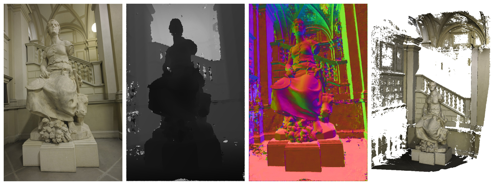

# A Modern PatchMatch Multi-View Stereo (MVS) Framework

This is an attempt to create a modern Multi-View Stereo (MVS), which is modern in two meanings:

- The code should be written using modern standards (at least C++11) and modern practices to make it safe, easy to understand and maintainable (e.g. COLMAP).
- The algorithms should be updated with state-of-the-art methods, like ACMM/ACMP. However, official implementations of these algorithms are unreadable and full of bugs.

The goal of this repository is to bring together the best of both worlds. MVS algorithms take a set of calibrated images (i.e. with both intrinsic and extrinsic parameters) and produce pixelwise estimates of depth, normal and cost, which can then be back-projected in 3D to obtain a full point cloud. For example, currently the code produce the following output for a scene from https://www.eth3d.net/:

## Usage

The code has been tested in Ubuntu 20 with a NVIDIA Tesla K80 GPU, but it should work with any reasonably recent version of CUDA and other required libraries.

### Dependencies

Currently, there are the following dependencies:

- `cuda-api-wrappers`, which is included in `lib/` and linked statically. This is just a modern wrapper around CUDA host-side API, which we all know being awfully old-fashioned.
- `RapidJson` is required to parse the configuration file. It can be easily installed with `apt` and it could even be removed in the future, if another file format is chosen.
- `OpenCV` is needed to handle images IO and simple operations (such as resizing). I don't see a future where this can be removed, but it is very easy to install with `apt`.
- `Eigen` is used for linear algebra. The main reason I decided to add Eigen is because it can be used inside CUDA kernels and it makes the code much more readable. `OpenCV` cannot be used in device-side code and raw arrays (e.g. in COLMAP) make things much less user-friendly (even if probably they are slightly faster).
- `PCL` is used only to store and save the resulting point cloud. I use this for convenience, but in theory it could be removed as PLY files are easy to write anyway.

### Build

I use CMake as build system and the code can be built by simply running `./scripts/bash/make.sh`. This will take care of the classical CMake pipeline and it should adapt to the available number of cores.

### Run

Currently, you need to run the code by executing the binary in the `build/` folder and passing the configuration file as the only argument. There are plans to modify this in the future (see TODO list). The input folder is assumed to be structured as required by MVSNet (https://github.com/YoYo000/MVSNet), mainly for compatibility. The correct format can be generated with existing repositories (https://github.com/morsingher/sfm_to_mvs), starting from the output of the COLMAP Structure-from-Motion library. The code will dump its output in the specified output folder.

## Contributions

I am more than happy to welcome any kind of suggestion or contribution. You can do it with both Github tools (such as Issues and Pull Requests) or by contacting me at `marco.orsingher@unipr.it`. Please format code using the `.clang-format` file provided. This can be done by running `./scripts/bash/format.sh`.

## TODO List

This repository is a work in progress and above all it serves for learning purposes. You can start to fix the TODOs below or you can read the code and point out other weak spots.

### Short Term

In order to increase stability and correctness:

- Write a bash script that can be run as `./scripts/bash/run.sh <data_folder>` and it takes care of everything
- Look for TODOs in the code and fix them. They are either bad or unclear parts
- Does `io_utils.*` make sense or should it just be removed?
- Headers should be included with correct folder and only where needed
- Set pointers as `__restrict__` in CUDA code, where applicable
- Pick a design choice between C++ exceptions and `if`/`else` statements
- Classes are designed poorly (i.e. just to make them work) and should be improved
- Include unit tests where possible to verify code correctness
- Start Doxygen documentation
- A lot of stuff in CUDA kernels could be moved to the configuration file. But should we do it? I don't know

### Long Term

In order to add new features:

- Implement planar priors from https://arxiv.org/abs/1912.11744
- Implement multi-scale approach from https://arxiv.org/abs/1904.08103
- Include global refinement from https://github.com/rossimattia/depth-refinement-and-normal-estimation (this requires to modify refinement code to correctly rotate and store normals)
- Offer keypoint initialization
- Experiment with depth-normal consistency term

## Acknowledgments

I would like to thank the authors of https://github.com/GhiXu/ACMMP, https://github.com/kysucix/gipuma and https://colmap.github.io/ to open source their work and their papers, from which I took a lot of inspiration. Moreover, thanks to `eyalroz` for his awesome CUDA wrapper: https://github.com/eyalroz/cuda-api-wrappers! 